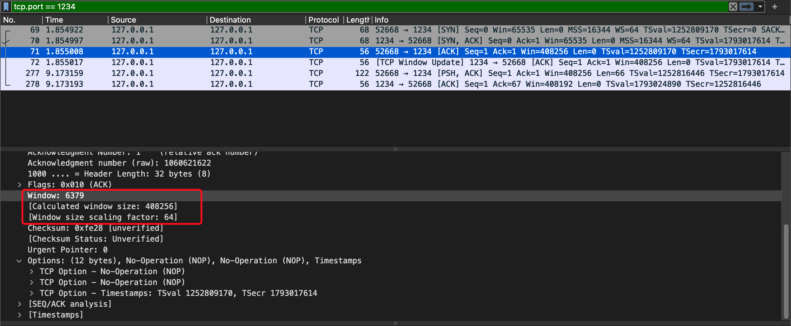
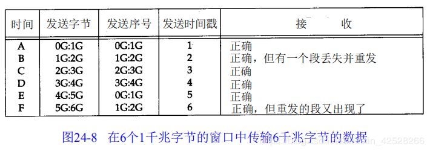
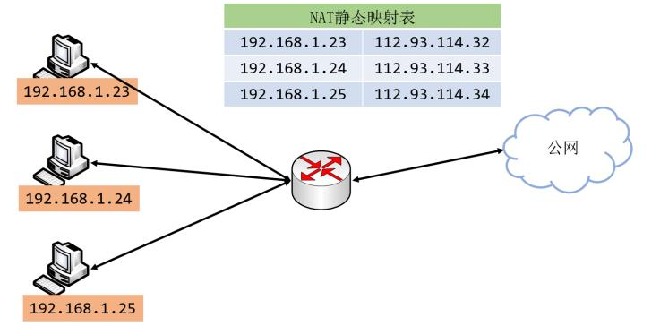

# TCP 协议中 Timestamp 选项

关于 timestamp 选项的最新 RFC 的描述是在 rfc7323 中。


<br>

## 1.  背景： Window Scale 选项
----

先了解下这个选项产生的背景，首先在 rfc793 中定义了数据传输重窗口的概念，表示窗口的大小的数值是 16bit ，也就是一个窗口中能携带的最大数据是 2^16 bytes, 也就是 65535 / 1024 = 63KB。但是随着网络的发展，这样的窗口上限，已经成了传输中的瓶颈了，也就是窗口数据太小，无法高效的利用网络。于是人们有想出了 **Window Scale** 的方法，是单个窗口的大小能够达到 1GiB。

如下图所示其中的在声明了 window scale 后， 实际的窗口大小是:
    
     ```6379 * (2^6) = 408256```



<br>

问题在于，当 window 最大到了 1GiB 后，如果连续多次传输，会造成 sequence number 的回绕问题。

先看看 rfc793 中对于 sequence number 的定义：
```
  Sequence Number:  32 bits

    The sequence number of the first data octet in this segment (except
    when SYN is present). If SYN is present the sequence number is the
    initial sequence number (ISN) and the first data octet is ISN+1.
```

sequence number 是一个 32bit 的无符号整数，这是一个有限的空间也就是每个 SN 能表示的数据范围是 2^32 byte 也就是 4GiB，所以当传输的数据达到 4GiB 时，sequence number 就会又从头开始。

与此同时，TCP 中为了保证稳定性，规定每个 segment 都有一个 MSL，也就是segment 的最大有效时间：
```
    MSL
        Maximum Segment Lifetime, the time a TCP segment can exist in
        the internetwork system.  Arbitrarily defined to be 2 minutes.
```

问题来了。当我们在高速网络下，如果我们某个数据段 x 需要重传，就可能跟 x + 4Gib 的数据段同时出现在网络上，造成数据冲突。也就是老数据和新数据使用了相同的 sequence number， 如下图所示:
<br>



<br>

上图中，32 bit的序号在时间D和时间E之间发生了回绕。假定一个报文段在时间 B丢失并被重传。还假定这个丢失的报文段在时间 E重新出现。

为解决 Window Scale 带来的问题，于是人们有想出了 TimeStamp 的办法。

<br>

## 2.  Timestamp 选项是什么
----

先看下定义

``` s
 TCP Timestamps option (TSopt):

   Kind: 8

   Length: 10 bytes

          +-------+-------+---------------------+---------------------+
          |Kind=8 |  10   |   TS Value (TSval)  |TS Echo Reply (TSecr)|
          +-------+-------+---------------------+---------------------+
              1       1              4                     4
```              

其实是在传输的数据里边加上了 12byte (额外的2字节的padding):

* TSval 是当前发送数据的一方的最新的时间戳 （默认就是递增的，注意下这个要点）

* TSval 是对端最近一次包传过来的时间戳

规则是这样的：

1. 对于时间戳选项的使用，要在 TCP 三次握手时协商

2. 如果发起方使用了 TSopt， 那接收方一定也要启用。

3. 当启用了 TS， 其后所有的包（除了 SRT） 都要包含 TSopt

关于 TM 的重要性，文档中也有描述:

```
   If a receiver chooses to accept a segment without an expected
   Timestamps option, it must be clear that undetectable data corruption
   may occur.

   Such a TCP receiver may experience undetectable wrapped-sequence
   effects, such as data (payload) corruption or session stalls.  In
   order to maintain the integrity of the payload data, in particular on
   high-speed networks, it is paramount to follow the described
   processing rules.
```

当在高速网络中，关闭 TMSopt 选项，风险是很大的。所以建议默认是开启，后边我们会说到，这个 TMSopt 跟 tw_reuse 的关系

<br>

## 3.  Timestamp 选项有什么用
----

这里只选几个看一下。

<br>

### 3.1 PAWS 机制 (Protect Againest Wrapped Sequence numbers)
<br>

Timestamp 的第一个用处就是解决我们上边提到的 Sequence number 在 MSL 时间内回绕的问题.

在这个机制中，需要假设 TimeStamp 是单调递增的, 如果不是的话，就认为该 segment 是无效的。

这里的单调递增是循环递增的，因为 32bit 时间戳的空间也是有限的（这个跟 sequence number 是一样的）

具体算法，就不在这里贴了。

<br>

### 3.2 RTT的测量
<br>

因为 TSval 和 TSecr 可以表示一个 数据包 发出和 其ACK发出的时间，所以我们可以使用他们作为 RTT 的时间， 但是测量 RTT 也是有规则的：

```
RTTM Rule: A TSecr value received in a segment MAY be used to update
        the averaged RTT measurement only if the segment advances
        the left edge of the send window, i.e., SND.UNA is
        increased.
```

这个规则的原因就是， TSecr 是最近的一次对端的包的时间，假设两端有一段时间是空闲的，那这个 TSecr 就不能准确的表示上一个包发出的时间了。所以才有了上边的规则，简单理解就是：

```
发送窗口打满了，并且向右移动时才算。也就是当前满窗口的第一个 segment 的 ACK 回来的时候才算。
```

这个问题的特例详见 rfc7323 的 4.1


<br>

## 4.  Timestamp 与 net.ipv4.tcp_tw_recycle
----
<br>

### 4.1.  net.ipv4.tcp_tw_recycle 是干什么的

这个是关于 TIME_WAIT 的一个配置， 我们先看一下 linux 内核中关于 tcp_tw_recycle 的描述:

```
tcp_tw_recycle (Boolean; default: disabled; since Linux 2.4)
Enable fast recycling of TIME-WAIT sockets. Enabling this option is not recommended since this causes
problems when working with NAT (Network Address Translation).
```

也就是这个开启这个选项以后，对于进入 TIME_WAIT 的 socket(一般是 server 端)，允许小于 2MSL 的时间内就可以被再次使用。问题在于网络上会不会有老的数据包，对新建立的连接造成影响吗？

为了解决这个问题，就用到了 TCP 中的 TMSopt 选项的了， 也就是所有小于上次 timestamp 的segment 都会被丢弃，linux 源码：

``` cpp
if (tmp_opt.saw_tstamp &&
    tcp_death_row.sysctl_tw_recycle &&
    (dst = inet_csk_route_req(sk, &fl4, req, want_cookie)) != NULL &&
    fl4.daddr == saddr &&
    (peer = rt_get_peer((struct rtable *)dst, fl4.daddr)) != NULL) {
        inet_peer_refcheck(peer);
        if ((u32)get_seconds() - peer->tcp_ts_stamp < TCP_PAWS_MSL &&
            (s32)(peer->tcp_ts - req->ts_recent) >
                                        TCP_PAWS_WINDOW) {
                NET_INC_STATS_BH(sock_net(sk), LINUX_MIB_PAWSPASSIVEREJECTED);
                goto drop_and_release;
        }
}
```

所以当连接的两端，在同时正确使用 timestamp 的情况下，打开这个选项是可以的，但是如 linux 的注释所说，在 NAT 网络中是有问题。

<br>

### 4.3. 为什么在 NAT 就不行
----
<br>

先看看什么是 NAT




因为client 在 NAT 内部可能有多个机器，NAT 内部的机器的时间戳可能不同，也就有可能 A机器 发起连接时的 SYN 的时间戳 比 已经连接的B 机器的时间戳小，所以当A 发起 SYN 连接的时候， NAT这端的 server 会任务这个 SYN 是无效的，会被丢弃。

这个 timestamp 不是每个连接的吗，为什么不同的不同的端口发起的连接还会导致 timestamp 冲突？

```
这个是因为在 linux 中开启了 ```tcp_tw_recycle``` 选项后，允许处于 TIME_WAI 端口可以在段时间内被再次使用。
因为 NAT 是的对外 IP 只有一个， server 端的 TIME_WAT 端口被重用时，可能出现该端口缓存的 timestamp 比新连接中 SYN 带过来的 timestamp 大，所以就会连接失败
```

timestamp 的引入并不光为了缩短 time_wait 的，如果是因为 NAT 网络导致，TCP 连接被丢弃，应该首先考虑关掉 tcp_tw_recycle

<br><br><br>

## 参考文档：
* https://datatracker.ietf.org/doc/rfc7323/
* https://cloud.tencent.com/developer/article/1598273
* https://github.com/torvalds/linux/blob/9ff9b0d392ea08090cd1780fb196f36dbb586529/include/net/tcp.h#L271