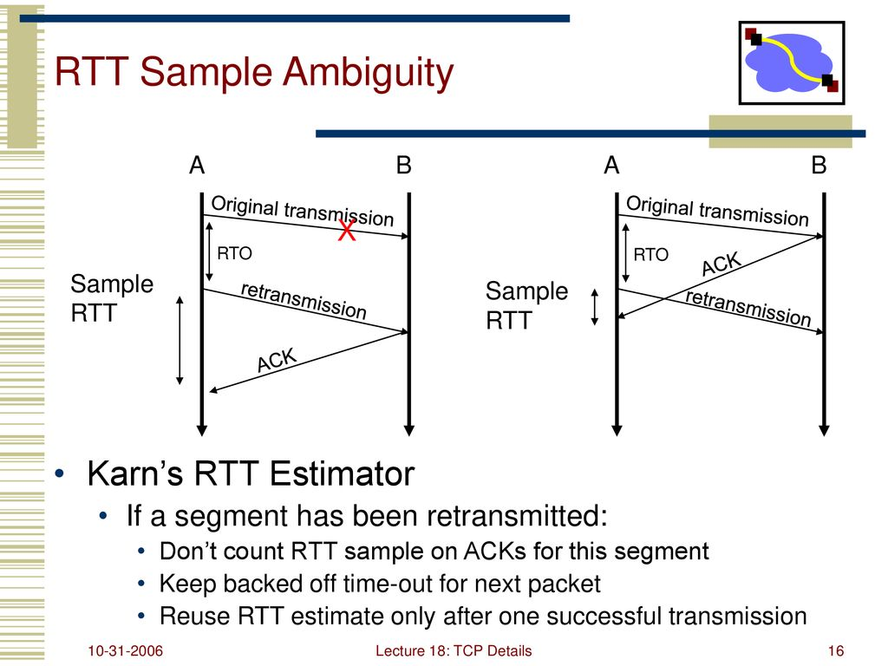

# TCP重传时间的计算

重传机制是 TCP 实现可靠传输的一个重要部分，而超时重传时间（ RTO (retransmission timeout) ）的确定又是比较核心的点。

TCP sender 端会对每个发出去且还没有收到 ACK 的 segment 启动一个 timer，当 timer 超时，则重发该 segment。问题来了： 这个 timer 超时时间设置多长比较合适？ 

如果超时时间太短，频发的重发数据，会造成带宽的浪费。相反，如果超时时间紧太长，则数据实时性就会降低。这篇我们就看看 TCP 对重传时间的计算。核心参考 rfc6298。

我们浏览一下 RTO 算法的演变历史，并且看看都有那些改进。

<br>

## 1. 什么是 RTT
----
<br>

主要依据是 **RTT (Round Trip Time)**, 也就是一个 octet 从发出去 到 收到 ACK 的时间。

注意它这里说的是一个字节从 发出 到 收到ACK 的时间，不必是相同的 segment。这个在定义上是这样讲比较严谨，但是实际中，TCP的发送都是按 segment 的。想不到什么情况会出现 segment 有交叉的情况。也许是中途丢了一部分，导致 receiver 在确认 ACK 的时候，只确认了一部分 ??

一个直观的理解如下图：


<br>

## 2. 早期版本
----
<br>

比较早的实现是在 RFC 793 中一个算法。


### 1.1 如何得到能反映网络实时状况的 RTT
<br>

需要注意的是网络情况是不断变化的，所以 RTT 也是不断变化的，如果以某一个固定的 RTT 作为基准，应该是很不准确的。于是人们使用多个 RTT 的均值作为基准。这样就较真实的动态的反映当前网络的情况。也就是 SRTT (Smoothed Round Trip Time) 平滑后的 RTT:

``` s
    SRTT = ( ALPHA * SRTT ) + ((1-ALPHA) * RTT)

    ( ALPHA is a smoothing factor (e.g., .8 to .9) )
```

其中 ALPHA 的作用是，减少新的 RTT 的值在 SRTT 中的比重，从而达到平滑的左右。也就是说，SRTT 会跟随新 RTT 的变化而变化，但是变化的过程比较缓慢。

比如某个突然增大的 RTT 会在一定程度上增大 SRTT， 但是影响很小。而接下来连续的几个 RTT 都很大的话，那 SRTT 也就升上去了。

也就是说 ALPHA 越小那 SRTT 越接近 最新的 RTT。

<br>

### 1.2 如何得到 RTO
<br>

当然 RTO(retransmission timeout) 的值肯定要比这个大一些才行，为了处理 RTO 计算时可能出现的奇异值(过大过小)，也就是把 RTO 限制在某个合理范围内。于是引入的上下限(UBOUND, LBOUND)。最终的 RTO 计算公式为:

``` s
    RTO = min[UBOUND,max[LBOUND,(BETA*SRTT)]]

    UBOUND is an upper bound on the timeout (e.g., 1 minute),
    LBOUND is a lower bound on the timeout (e.g., 1 second)
```

<br>

如上这就是 RTO 早期的一个版本。

TODO: 这个算法的问题缺点是？？

<br>

## 3. Jacobaon/Karels 算法
----
<br>

在这个算法计算时， TCP 的 sender 会维护两个状态变量：

* SRTT(smoothed round-trip time)： 这个如前所定义一样
* RTTVAR (round-trip time variation)： 这个是 round-trip time 的变化值。

步骤如下：

1. RTO 初始值是 -1

2. 当我们得到第一个 RTT 的值 R 的时候，作如下更新：

    ``` s
    SRTT = R    
    RTTVAR = R/2

    RTO = SRTT + max(G, 4*RTTVAR)
    ```

    其中 G 是时钟粒度(clock granularity)

3. 当后续的 RTT 的值 R' 获得的时候，需要更新我们的两个状态变量，并且执行的顺序不能变， 然后在跟新 RTO：
   
   ``` s
   RTTVAR = (1 - 0.25) * RTTVAR + 0.25 * |SRTT - R'|
   SRTT = (1 - 0.125) * SRTT + 0.125 * R'
   
   RTO = SRTT + max (G, 4*RTTVAR)
   ```

   这里计算出来的 RTO 也是有上下限要求的, 最小值是 1s， 最大值应大于等于 60s


<br>

## 4. RTT 采样时的问题
----
<br>

如下图所示，如果发生重传了，那 RTT 采样应该用哪一段呢？



<br>

为了避免 重传 带来的 RTT 的不准确，就有了 karn 算法，基本思想就是: 这种特殊情况我们没法确定要用哪一个，因为有歧义，干脆那我们就不用它。只用正确的情况。

但是这样就不能把当前重传的 segment 的 RTT，反映到 SRTT 里边了，也是 SRTT 不能随着网络阻塞而增大了。

于是有了改进后的 Karn 算法， 对于重传的包有：
    
``` cpp

RTO_retry_old = max(RTO_retry_old, RTO_normal)

RTO_retry_new = 2 * RTO_retry_old
```

这样对于重传的包，能很好的反应当前网络了。

当之后包正常之后，SRTT 和 RTO 就有可以动态更新了。

<br><br>


<br><br><br>

## 参考资料
----

1. [rfc6298: Computing TCP's Retransmission Timer](https://datatracker.ietf.org/doc/rfc6298/)

2. [rfc1122: Requirements for Internet Hosts - Communication Layers](https://datatracker.ietf.org/doc/rfc1122/)

3. [rfc793: Transmission Control Protocol](https://datatracker.ietf.org/doc/rfc793/)

4. [computer networking](https://slideplayer.com/slide/15417191/)