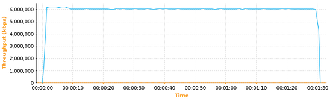
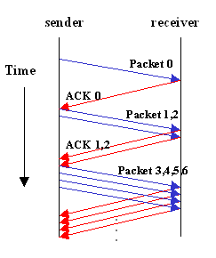

# 拥塞控制

主要基于 rfc2581

rfc896 中也叫拥塞控制，但是二者还是有区别的。

* rfc896 主要解决的是如何避免小包导致的带宽浪费，大量小包引起的拥塞控制

* rfc2581 是解决非小包问题，在引入拥塞控制后，使得发送窗口可以随着 **网络的反馈** 动态变化

为什么要有拥塞控制
    
    极限情况是，因为如果网络中的连接太多，倒是网络堵塞，因为发送端不断重传，到最后，重传最终失败就会导致连接断开。
    
    但是这里的连接是没必要断开的，只要减少包的发送，就可以以较慢的数据继续而不必断开连接。将要介绍的算法就是如何在未知的网路状况中，动态的找到一个合适的传输速率。

主要有 4 个算法，或是 4个阶段, 其中前两个是在 发送端 实现的， 后两个是在 接收端 实现的。

1. 慢启动(sender)
2. 拥塞避免(sender)
3. 快速重传(receiver)
4. 快速恢复(receiver)

这四个是独立的算法，但是一般配合使用，我们根据具体在哪端实现，来分两个部分说下

<br>

## 1. 慢启动
----

首先，慢启动在我们现在看来并不“慢”，它的发送窗口增长是按指数增长的，那为什么还叫 "慢"启动 ？

这个慢是相对于之前，直接按接收端提供的窗口 **固定** 全量发送，根本没有考虑网络拥塞的情况。而拥塞控制，则使得发送窗口可以随着网路的反馈动态变化，慢启动是有个增长的过程。

这个慢启动增长过程也是有上限的，要是是到达阈值，要么检测到了网络拥塞。

所以这里有两个重点：
        
1. 这个阈值是怎么设置的，是怎么动态修改的？
   
2. 发送端是怎么检测到网络拥塞的？

<br>

### 1.1 接收窗口 和 拥塞窗口
<br>

这两个窗口本质上代表这不同的对象， 接收窗口对应的是receiver端的限制，而拥塞窗口对应的是网络本身的限制(反映的是网路的拥堵情况)。
所以也就不难理解 发送端要用这两个中的最小值。
    
实际上 初始的拥塞窗口一般就是 1 到 2 个 segment 的大小，而 receiver window 确很大

<br>

### 1.2 慢启动阈值 (ssthresh)

<br>

慢启动是 TCP 在未知的网络状况情况下，网络情况也是不断变化的，逐步探测网络状况上限的一个过程。    

这个东西是干什么用的： 当前 sender 是处于 慢启动状态，还是 拥塞避免状态。这个阈值本身也是动态变化的。

* 拥塞窗口(cwnd) < 慢启动阈值(ssthresh): 慢启动期间，直白理解就是网络上限探测期间

* 拥塞窗口(cwnd) > 慢启动阈值(ssthresh): 拥塞避免期间，直白理解就是 TODO

<br>

**它的初始值是如何确定的？**

```
初始值可以是一个很大的值，然后等待拥塞后折半减小。

初始值一般来说就是 receiver 告知的接收窗口的大小，其上限是 65535（因为tcp header 中窗口大小是用 2个 bytes 表示的） ， 也就是接收窗口的最大值了。所以有的实现中初始值就会用 65535。

( Actually a little research reveals that more modern TCP implementations often set the slow-start threshold to infinite (meaning a very high value like 2^31). Using an infinite value means that the congestion window will grow exponentially until a loss occurs. This way the optimal value is found more quickly. )

所以当 ssthresh 为 65535 时， 在以太网情况下，能传输的窗口上限可以多达 44个 (65535/1460)。
```

根据作者的研究，现在往往正常的网络情况就能达到并保持这个峰值：

What happens if we increase the ByteBlower’s internal slow-start threshold value from 65535 to infinite (actually 2^31)? Here is the resulting graph:



As you can see the peak throughput is now reached almost instantly!

<br>

**它是如何动态变化的？**

当没有检测到拥塞时，就会一直增加，知道阈值。

当检测到拥塞时：折半操作，也就是拥塞阈值降低为 cwnd 的一半， cwnd 的大小变为拥塞阈值（cwnd 也折半）

<br>

    

<br>

### 1.3 慢启动的过程：
<br>

|  图例   | 步骤  |
|  ----  | ----  |
|   | 1. 进入慢启动状态后，sender 端的以 SMSS 的步长， 对拥塞窗口(cwnd) 进行翻倍操作。<br>&nbsp; &nbsp; &nbsp; &nbsp;慢启动初始的拥塞窗口是 1 个 segment<br><br>2. 翻倍的条件是收到上一个 segment 的 ACK <br>&nbsp; &nbsp; &nbsp; &nbsp;每收到一个 ACK 累计窗口，然后就可以继续连续发送 上一次 *2 的 segments 了。<br>&nbsp; &nbsp; &nbsp; &nbsp;也就是说，每经过一个 RTT，拥塞窗口 翻倍。<br><br>3. 慢启动结束的的两个条件<br>&nbsp; &nbsp; &nbsp; &nbsp;1) 拥塞窗口(cwnd) > 慢启动阈值(ssthresh)<br>&nbsp; &nbsp; &nbsp; &nbsp;2) 网络出现拥塞（也就是重传超时到了 或是 收到3个重复的ACK）<br><br>TODO: 为什么是 3 个 ACK ??<br>|


<br>

举例说明，假设初始的慢启动阈值是 16：

1. 假设当前发送方拥塞窗口cwnd的值为1，而发送窗口swnd等于拥塞窗口cwnd，因此发送方当前只能发送一个数据报文段（拥塞窗口cwnd的值是几，就能发送几个数据报文段）。

2. 接收方收到该数据报文段后，给发送方回复一个确认报文段，发送方收到该确认报文后，将拥塞窗口的值变为2，发送方此时可以连续发送两个数据报文段。

3. 接收方收到该数据报文段后，给发送方一次发回2个确认报文段，发送方收到这两个确认报文后，将拥塞窗口的值加2变为4，发送方此时可连续发送4个报文段。

4. 接收方收到4个报文段后，给发送方依次回复4个确认报文，发送方收到确认报文后，将拥塞窗口加4，置为8，发送方此时可以连续发送8个数据报文段。

5. 接收方收到该8个数据报文段后，给发送方一次发回8个确认报文段，发送方收到这8个确认报文后，将拥塞窗口的值加8变为16。

<br>


### 1.4 其他
<br>

如果慢启动期间就发生了 超时重传，那就和拥塞避免一样的，也是把ssthresh降为一半，然后把拥塞窗口调整为1，重新慢开始。

<br>


## 2. 拥塞避免
----
<br>


<br><br><br>

## 参考文档
----

* ["Slow Start" in TCP](https://www.isi.edu/nsnam/DIRECTED_RESEARCH/DR_HYUNAH/D-Research/slow-start-tcp.html)
* [Optimizing the TCP congestion avoidance parameters for gigabit networks](https://www.excentis.com/blog/optimizing-tcp-congestion-avoidance-parameters-gigabit-networks)