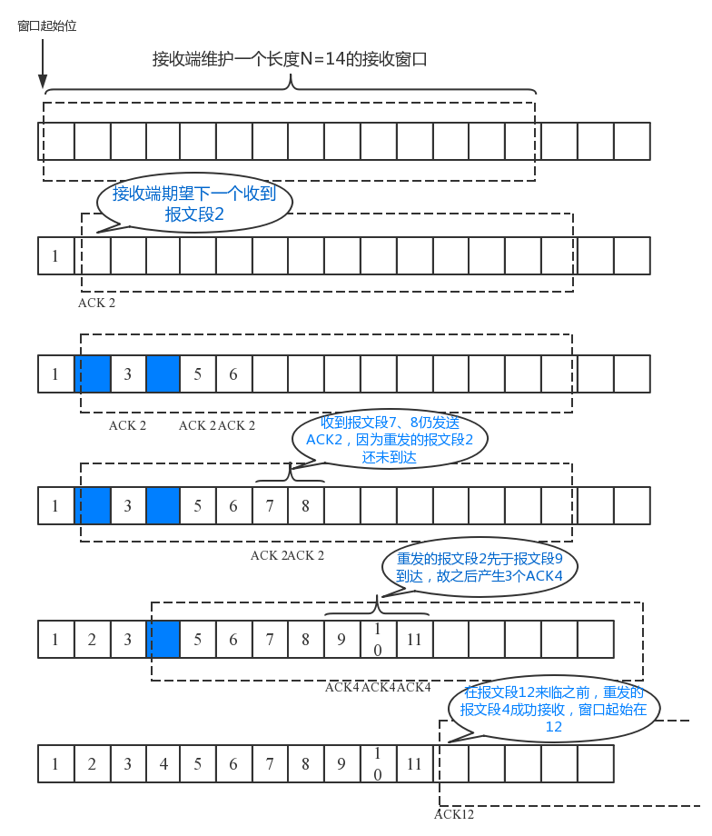

# 拥塞控制

一句话理解拥塞控制，当前网络环境下，我们到底应该发多块。

注意当前网络是动态的。

另外如果网络吞吐 永远大于 receiver 的 advertised window 那拥塞控制是没有意义的。

<br>

rfc896 中也叫拥塞控制，但是二者还是有区别的。

* rfc896 主要解决的是如何避免小包导致的带宽浪费，大量小包引起的拥塞控制

* rfc2581 是解决非小包问题，在引入拥塞控制后，使得发送窗口可以随着 **网络的反馈** 动态变化

为什么要有拥塞控制

    极限情况是，因为如果网络中的连接太多，倒是网络堵塞，因为发送端不断重传，甚至有可能导致连接断开。
    
    但是这里的连接是没必要断开的，只要减少包的发送，就可以以较慢的数据继续而不必断开连接。将要介绍的算法就是如何在未知的网路状况中，动态的找到一个合适的传输速率。

    In October of '86, the Internet had the first of what became a series of 'congestion collapses.' During this period, the data throughput from LBL to UC Berkeley (sites separated by 400 yards and three IMP hops) dropped from 32 Kbps to 40 bps.

主要有 4 个算法，其中前两个是在 发送端 实现的， 后两个是在 接收端 实现的。

1. 慢启动(sender)
2. 拥塞避免(sender)
3. 快速重传(receiver)
4. 快速恢复(receiver)

这四个是独立的算法，但是一般配合使用，我们根据具体在哪端实现，来分两个部分说下

<br>

## 1. 慢启动
----

首先，慢启动在我们现在看来并不“慢”，它的发送窗口增长是按指数增长的，那为什么还叫 "慢"启动 ？

这个慢是相对于之前，直接按 "advertised window" **固定** 全量发送，根本没有考虑网络拥塞的情况。而拥塞控制，则使得发送窗口可以随着网路的反馈动态变化，慢启动是指有个增长的过程。

慢启动的目的是以较长的步进，先粗略的找到一个上限，也就是修正 ssthresh 的过程。

这个慢启动增长过程也是有上限的，要是是到达阈值，要么检测到了网络拥塞。

所以这里有两个重点：
        
1. 这个阈值是怎么设置的，是怎么动态修改的？（）
   
2. 发送端是怎么检测到网络拥塞的？

<br>

### 1.1 接收窗口 和 拥塞窗口
<br>

这两个窗口本质上代表这不同的对象， 接收窗口对应的是receiver端的限制，而拥塞窗口对应的是网络本身的限制(反映的是网路的拥堵情况)。
所以也就不难理解 发送端要用这两个中的最小值。
    
实际上 初始的拥塞窗口一般就是 1 到 2 个 segment 的大小，而 advertized window 确很大, tcp header 用 2 个 bytes 标识 window 大小，所以上限是 65535 bytes。（在不考虑window scale 的情况下）

<br>

### 1.2 慢启动阈值 (ssthresh)

<br>

慢启动是 TCP 在未知的网络状况情况下，网络情况也是不断变化的，逐步探测网络状况上限的一个过程。    

这个东西是干什么用的： 当前 sender 是处于 慢启动状态，还是 拥塞避免状态。这个阈值本身也是动态变化的。

* 拥塞窗口(cwnd) < 慢启动阈值(ssthresh): 慢启动期间，直白理解就是网络上限探测期间

* 拥塞窗口(cwnd) > 慢启动阈值(ssthresh): 拥塞避免期间，直白理解就是 TODO

<br>

**它的初始值是如何确定的？**

```
初始值可以是一个很大的值，然后等待拥塞后折半减小。

初始值一般来说就是 receiver 告知的接收窗口的大小，其上限是 65535（因为tcp header 中窗口大小是用 2个 bytes 表示的（不考虑 window scale））， 也就是接收窗口的最大值了。所以有的实现中初始值也会用 65535 。

( Actually a little research reveals that more modern TCP implementations often set the slow-start threshold to infinite (meaning a very high value like 2^31). Using an infinite value means that the congestion window will grow exponentially until a loss occurs. This way the optimal value is found more quickly. )

所以当 ssthresh 为 65535 时， 在以太网情况下，能传输的窗口上限可以多达 44个 (65535/1460)。
```

根据作者的研究，现在往往正常的网络情况就能达到并保持这个峰值：

What happens if we increase the ByteBlower’s internal slow-start threshold value from 65535 to infinite (actually 2^31)? Here is the resulting graph:


As you can see the peak throughput is now reached almost instantly!

<br>

**它是如何动态变化的？**

当没有检测到拥塞时，就会一直增加，知道阈值。

当检测到拥塞时：折半操作，也就是拥塞阈值降低为 cwnd 的一半， cwnd 的大小变为拥塞阈值（cwnd 也折半）

<br>

<br>

### 1.3 慢启动的过程：
<br>

|  图例   | 步骤  |
|  ----  | ----  |
|   | 1. 进入慢启动状态后，sender 端的以 SMSS 的步长， 对拥塞窗口(cwnd) 进行翻倍操作。<br>&nbsp; &nbsp; &nbsp; &nbsp;慢启动初始的拥塞窗口是 1 个 segment<br><br>2. 翻倍的条件是收到上一个 segment 的 ACK <br>&nbsp; &nbsp; &nbsp; &nbsp;每收到一个 ACK 累计窗口，然后就可以继续连续发送 上一次 *2 的 segments 了。<br>&nbsp; &nbsp; &nbsp; &nbsp;也就是说，每经过一个 RTT，拥塞窗口 翻倍。<br><br>3. 慢启动结束的的两个条件<br>&nbsp; &nbsp; &nbsp; &nbsp;1) 拥塞窗口(cwnd) > 慢启动阈值(ssthresh)<br>&nbsp; &nbsp; &nbsp; &nbsp;2) 网络出现拥塞（也就是重传超时到了 或是 收到3个重复的ACK）<br><br>TODO: 为什么是 3 个 ACK ??<br>|


<br>

举例说明，假设初始的慢启动阈值是 16：

1. 假设当前发送方拥塞窗口cwnd的值为1，而发送窗口swnd等于拥塞窗口cwnd，因此发送方当前只能发送一个数据报文段（拥塞窗口cwnd的值是几，就能发送几个数据报文段）。

2. 接收方收到该数据报文段后，给发送方回复一个确认报文段，发送方收到该确认报文后，将拥塞窗口的值变为2，发送方此时可以连续发送两个数据报文段。

3. 接收方收到该数据报文段后，给发送方一次发回2个确认报文段，发送方收到这两个确认报文后，将拥塞窗口的值加2变为4，发送方此时可连续发送4个报文段。

4. 接收方收到4个报文段后，给发送方依次回复4个确认报文，发送方收到确认报文后，将拥塞窗口加4，置为8，发送方此时可以连续发送8个数据报文段。

5. 接收方收到该8个数据报文段后，给发送方一次发回8个确认报文段，发送方收到这8个确认报文后，将拥塞窗口的值加8变为16。

<br>


### 1.4 慢启动结束 和 慢启动充值
<br>

慢启动结束的两个条件：

1. cwnd exceeds(or equal) ssthresh

    这种情况下，情况是慢启动真正完成结束的条件，我们认为算是 **成功的** **粗略的** 找到了一个网络的上限。这时就可以转到拥塞避免阶段了。

1. when congestion is observed

    这种情况下，说明我们当前设置的 ssthresh 值是偏大的。所以此时我们把 ssthresh 减半，即 ssthresh = ssthresh / 2;
    
    然后拥塞窗口 cwnd 也重置，从头开始，再一次开启慢启动过程，检查这次的 ssthresh 值，是否合适。
    
    重复执行慢启动，直到 cwnd >= ssthresh 。

<br>


## 2. 拥塞避免
----
<br>

当慢启动结束（找到了合适的 ssthresh ）后，此时就进入了 拥塞避免 阶段。

之前我们说过，慢启动是粗略的找到一个上限，而拥塞避免则是继续精细的探测上限。

从另外一个角度看，慢启动是 开了加速度 的步进， 而拥塞控制则是 关了加速度的 步进，但仍然在前进。

此时的步进，每一个 RTT 只增加一个 segment。

举例说明，假设当前慢启动阈值是 10：

1. 假设当前发送方拥塞窗口cwnd的值为10，而发送窗口swnd等于拥塞窗口cwnd，因此发送方当前能发送 10 个数据报文段（拥塞窗口cwnd的值是几，就能发送几个数据报文段）。

2. 接收方收到该数据报文段后，给发送方回复一个确认报文段，发送方收到该确认报文后，将拥塞窗口的值变为10 + 1/10，发送方此时仍然只能连续发送 10 个数据报文段。

3. 直到发送方收到 10 个 报文的 ack， 拥塞窗口变为 10 + 10/10 = 11, 此时发送发可以连续发送 11 个segment。


慢启动 和 拥塞控制的变化过程如下，这个是慢启动超时的情况。注意看 ssthresh 的变化。


这个是慢启动没有超时的情况。注意看 ssthresh 的变化。


<br>


## 3. 快速重传
----
<br>

为了理解快速重传到底快在哪里，就先要知道普通的重传。普通的重传，是当一个 segment 传出之后，TCP 会根据 RTT 设置一个重传超时的 timer，也就是当这个 timer 超时后，也没有收到对应的 ACK，就触发重传动作。

而快速重传是当 sender 收到 3 个重复的 ACK 时，就立即重传，而不用等待重传超时触发。

这里为什么是 **3** 个重复，而不是 1 个 或是 2 个 ？

```
    首先，TCP ACK 的回复是当前 buffer 中连续数据中最新的那个 segmnent +1 ， 也就是如果 receiver buffer 中 有编号为 1 3 4 的segment，当收到编号为 5 的segment后， 回复 ACK 仍然是 2.

    因为网络包可能由于走的路由不同，有先后到达的情况，当编号 为 3，4 的 segment 到达的时候，不能断定 2 号 segment 丢了。如果晚于之后的两个 segment 到达，那大概率是丢了，所以这里的3，只是说概率很大。
```

快速重传的流程：


如图所示：

1. 报文段1成功接收并被确认ACK 2，接收端的期待序号为2

2. 当报文段2丢失，报文段3失序到来，与接收端的期望不匹配，接收端重复发送冗余ACK 2。

3. 如果在超时重传定时器溢出之前，接收到连续的三个重复冗余ACK（其实是收到4个同样的ACK，第一个是正常的，后三个才是冗余的）
   
   发送端便知晓哪个报文段在传输过程中丢失了，于是重发该报文段，不需要等待超时重传定时器溢出，大大提高了效率。这便是快速重传机制。


<br>

如下是 sender / receiver 端 buffer 中 窗口变化：

|overview|receiver|
|-|-|
|||

<br>

## 4. 快速恢复
----
<br>

注意当快速重传条件确认后（也就是3次冗余ACK），马上进行重传，并把 timer 重置，避免 timeout 造成 TCP 进入慢启动阶段，因为重新进入慢启动会使当期连接传输率下降。当快速重传发生后，此时已经说明有包丢失了，此时不会重启慢启动阶段，但是执行快速回复操作：

1. 设置 拥塞窗口(cwnd) 为 cwnd = cwnd / 2

2. 后续的报文每收到一个 ACK ，仍然执行 cwnd = cwnd + 1

这样的做法，防止 cwnd 回到1，然后从头开始。

有个图片可以直观的理解下：


<br>

一个完整的流程如下：

<br>


<br>

## 5. 其他资料
----
<br>

这套机制背后的思想还是非常值得的学习的, 这个流程教会了我们

    如何在未知的环境下，探测环境的边界。
    
    并且如何根据环境的反馈动态的调整我们的流程。

贴一下网上找来的资料:

> AIMD: additive increase, multiplicative decrease
>
> The basic AIMD algorithm then goes as follows, assuming that packet loss is used as an indicator of congestion:
>
> Additive increase: Increase the CWND by a fixed amount (e.g., one MSS) every round-trip time (RTT) that no packet is lost.
> Multiplicative decrease: Decrease the congestion window by a multiplicative factor (e.g., 1/2) every RTT that a packet loss occurs.


<br><br><br>

## 参考文档
----

* ["Slow Start" in TCP](https://www.isi.edu/nsnam/DIRECTED_RESEARCH/DR_HYUNAH/D-Research/slow-start-tcp.html)
* [Optimizing the TCP congestion avoidance parameters for gigabit networks](https://www.excentis.com/blog/optimizing-tcp-congestion-avoidance-parameters-gigabit-networks)
* [TCP congestion control experiment](https://witestlab.poly.edu/blog/tcp-congestion-control-basics/)
* [TCP的快速重传机制](https://www.jianshu.com/p/62940de97ca5) (非常感谢)
* [TCP Reno and Congestion Management](http://intronetworks.cs.luc.edu/current/html/reno.html#tcp-reno-and-fast-recovery)
* [RFC 2581: TCP Congestion Control](https://datatracker.ietf.org/doc/rfc2581)