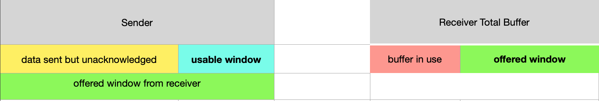

# 糊涂窗口（小窗口）

糊涂窗口是在滑动窗口机制中出现的。也就是一种比较机械糟糕的滑动窗口实现，换句话说，就是在实现滑动窗口时，没有考虑一些边缘情况。

这里的糊涂窗口比价抽象，具体来说，就是数据传输中可能因为一些场景使网络上产生大量小分组，也就是有效数据载荷很低的 segment， 造成了带宽的浪费，同时引起了网络拥塞，这也就是为什么人们想各种办法去避免小包的产生。

在了解糊涂窗口之前，我们先回顾一下滑动窗口的实现。

<br>

## 1. 回顾滑动窗口的实现
----

两个主要的概念：

* offered window: 这个指的是 receiver 端 buffer 中 可用的大小, 是 receiver 通知给 sender 的

* usable window: 这个指的是 sender 端计算出来的，还可以发送多少数据，计算方法是：

    usable_window = offered_window - anacknowlaged_data

直观的表示如下图所示:
<br>



<br>

在正常的情况下，假设有大量数据数据，sender 根据 offered_window, 通过握手时协商的 MSS，把数据分隔成多个 segments 发送。假设一开始的 offered_window 是 1000 bytes， MSS是 200 bytes， 在开始 sender 数据重组的情况下，有：

1. sender 组织每个 segment 为 200 bytes，根据 offered_window 的大小，连续发送 1000/200=5 个 segment，然后等待 ACK。

2. reciever 收到 第一个 segment 后，并且在 buffer 中被应用层拿走了， 返回 ACK。因为 receiver buffer 为空了，所以 receiver 会返回一个 1000 bytes 的 offered_window。

3. sender 收到 ACK 后，根据判断还有 800 bytes 还有没有收到 ACK，所以 usable_window 为 200 bytes。

4. sender 继续发送 200 bytes 作为一个 segment，此时的 usable_window 为 0 byte

以上就是滑动窗口工作的大致流程。

<br>

## 2. silly window 产生的两种情况
----

<br>

如上所述，在有源源不断的大量数据产生的情况下，没有问题。但是当 sender 或是 receiver 有一端不能处理 full_segment 的数据时，就会产生小窗口。

<br>

### 2.1. sender 端引起的小窗口
<br>

比如接着 1. 中的流程，可能出现如下的情况

1. 收到一个 50 byte 带 urgent 的数据，于是 sender 会马上把这个 50 bytes 作为一个 segment 发出去，此时 usable_window 为 150

2. 紧接着，后边的数据只能发送 150 bytes ，也作为一个 segment， 此时 sender 的 usable_window 为 0

3. receicer 处理完 50 bytes 后，返回这个 segment 的 ACK，于是 sender 这边的 usable_window 有变成了 50， 于是在拿出 50 bytes 作为一个 segment 发出去。此时 sender 的 usable_window 为 0

4. receicer 处理完 150 bytes 后，返回这个 segment 的 ACK，于是 sender 这边的 usable_window 有变成了 150， 于是在拿出 150 bytes 作为一个 segment 发出去。此时 sender 的 usable_window 为 0

从上边的流程中可以看到，当在发送端，有一个小包发出去后，会把一个 full-segment 拆成两个。 并且这种情况一般不会恢复，随着这种情况多次出现，网络上的小包会越来越多。

<br>


### 2.2. receiver 端引起的小窗口
<br>

这种情况是因为 receiver 端数据处理速度太慢， 比如接着 1. 中的流程：

1. 当 receiver 收到 200 bytes，后应用层很长时间值处理了 20 个 bytes， 当 receiver 中的 buffer 空出来 20 bytes 后，会立即通知 sender ， 这边 offered_window 从 0 变成了 20 bytes

2. sender 收到 window update 通知后，看到可以发送数据了，于是拿出 20 bytes 的数据组装成 一个 segment 发出去，此时 sender 的usable_window 为0

3. 当 receiver 不断的以 20 bytes 的速度处理数据，然后就不断的以 20 bytes 的窗口通知 sender。sender 也就不断的发送 20 bytes 的segemnt

4. 如此下去，网络上就会有，大量小包了。


<br>

## 3. 解决办法
----

根据不同的端，有不同的解决办法。

<br>

### 3.1. sender 端的解决办法
<br>

Nagle 算法算是解决网络上小包引起的拥塞的办法。思路就是网络上只允许有一个 **为被确认** 的 **小包**。在 Negla 那篇中详细介绍过，这里不在赘述。

我们这里描述下 rfc813 中提出的办法，在 1. 中我们可以看到，offered_window 并不能表示所有传出的的数据，可能数据还在线路上。所以文中提出来一个办法，简言之：
    
```
判断当前线路上是否还有大量数据(也就是将来能空出来更多的 usable_window 空间)， 如果有的话，那就等待ACK返回，知道 usable_window 足够大。
```

判断线路上数据量的办法，就是利用 usable_window 跟 offered_window 的比值 ratio:

$$ratio = \frac {usable\_window} {offered\_window} $$

比如如果比值小于 25% 那我们认为至少有 75% 的数据还在线路上，我们就暂缓发送数据。

<br>

<br>

### 3.2. receiver 端的解决办法
<br>

receiver 端的解决思路，就是也是尽可能的等处理的数据积攒到一定量时，才通知给 sender，这样 sender 即时理解发送数据，也不会产生很多小的 segment。

1. 延时 Window update 通知： 当 receiver 端的 offerd_window 变的很小的时候，不去通知 sender update window， 直到等到其 offered_buffer 达到一个 segment（也就是 MSS 大小），或是超过其 buffer 大小的一半时，才去通知。
   
   也就是当回复 ACK 的时候，不携带 update window 选项

2. 延时的 ACK： 延时发送 ACK，但是需要注意的是，这里的延时时间要小于对端重发的超时时间，也就是要赶在对端重发之前发送ACK。


<br>

## 4. 总结
----

其实不管是 Nagle 算法，还是延时确认，都是在尽量减少网络上的小包数量。反过来就是尽量提高网络的有效数据负载。因为低负载造成的了网络资源的浪费，这时就是 TCP 协议本身需要优化的问题。但是如果都是满负荷，还是出现了拥堵，那就不是 TCP 协议的问题了，是物理网络的问题了。这个还是要区分的。所以看 TCP 的各种优化补丁，大部分都是在针对提高网络的有效负载。

在[What Is Silly Window Syndrome?](https://www.extrahop.com/company/blog/2016/silly-window-syndrome/)，一文中使用卡车装货的比喻很形象。

在应用层看，TCP 是字节流类型的传输，但是到了具体的传输实现上，还是需要一个 segment 一个 segment 发送的。也就引出了 segment 中有效数据负载的问题。

比如在 MTU 为 1500 的网络中， 每个 segment 固定消耗 52 byte(加时间戳)， 
    
    如果一个 segment 传 1448 bytes，就是满负荷。
    
    如果一个 segment 传 1 byte，那负荷很小，就很浪费资源。

就比如，没人开一个轿车上下班(有效负载低)，那指定堵车。但是大家尽量做公交，或是每个轿车尽量都坐满人，那情况就会改善很多了。

我们要以 搬家公司 和 道路管理局 的思路去看 TCP 的设计。虽然我们本质上只是一个 司机。

<br><br><br>

## 参考文档：
* https://zhuanlan.zhihu.com/p/60743838
* https://datatracker.ietf.org/doc/rfc813/
* https://github.com/torvalds/linux/blob/9ff9b0d392ea08090cd1780fb196f36dbb586529/include/net/tcp.h#L271
* https://www.extrahop.com/company/blog/2016/silly-window-syndrome/